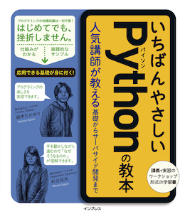

# いちばんやさしいPythonの教本のサンプルコード

* サンプルコードのリポジトリ: https://github.com/beproud/yasashiipython/

## 書籍概要

* [いちばんやさしいPythonの教本](http://book.impress.co.jp/books/1116101151 "いちばんやさしいPythonの教本 人気講師が教える基礎からサーバサイド開発まで - インプレスブックス")
* 価格: 2,200円+税
* 発売日: 2017年8月10日
* ページ数: 272
* サイズ: B5変形判
* 著者: 鈴木 たかのり/杉谷 弥月/株式会社ビープラウド
* ISBN: 9784295002086

## 目次

* Chapter 1: Pythonを学ぶ準備をしよう
* Chapter 2: コマンドプロンプトに慣れよう
* Chapter 3: 基礎を学びながらプログラムを作成しよう
* Chapter 4: 繰り返しと条件分岐を学ぼう
* Chapter 5: 辞書とファイルの扱いを学ぼう
* Chapter 6: 会話botを作ろう
* Chapter 7: ライブラリを使いこなそう
* Chapter 8: サードパーティ製パッケージを使いこなそう
* Chapter 9: Webアプリケーションを作成しよう
* Chapter 10: さらに知識を身に付けるための学び方
